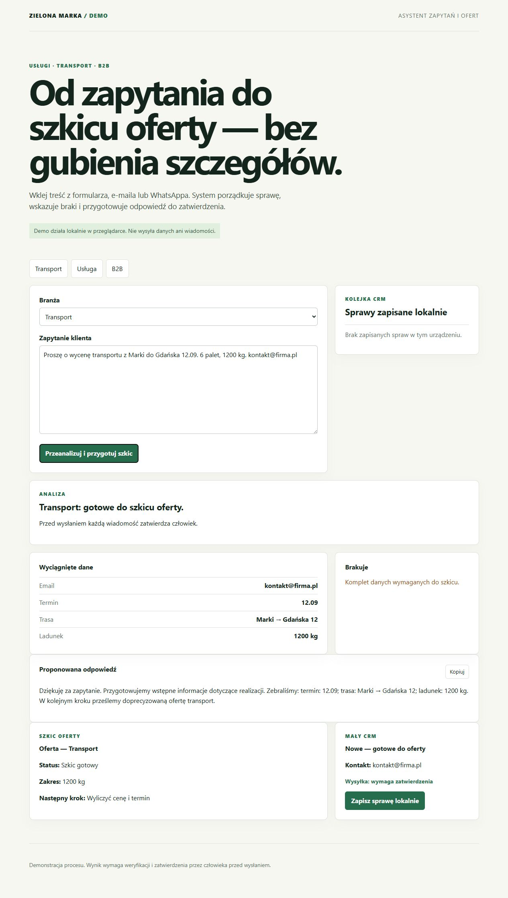

# Lead & Offer Copilot

Open-source starter i demonstracja procesu obsługi zapytań dla firm transportowych, usługowych, warsztatów, beauty oraz B2B.



**Demo online:** https://lead-offer-zm.pages.dev/

**Kod:** https://github.com/lukaszst-cz/lead-offer-copilot

```
zapytanie → wyciągnięcie danych → braki → odpowiedź → szkic oferty → mały CRM → akceptacja człowieka
```

## Co pokazuje

- rozpoznawanie podstawowych danych z wklejonej wiadomości;
- osobne wymagania dla transportu, usług, warsztatu, beauty i B2B;
- propozycję odpowiedzi i szkic kolejnego kroku;
- lokalne zapisanie sprawy w kolejce CRM;
- zasadę: żadna odpowiedź nie jest wysyłana bez zatwierdzenia przez człowieka.

## Dla kogo

- firmy transportowe, które wyceniają kursy na podstawie trasy, terminu i ładunku;
- usługi terenowe, które potrzebują szybko doprecyzować zakres, lokalizację i termin;
- warsztaty, salony beauty oraz firmy B2B obsługujące zapytania w wielu kanałach.

## Bezpieczeństwo demonstracji

To jest demo działające w przeglądarce: nie wysyła danych do zewnętrznego AI, e-maila ani WhatsAppa. W wersji produkcyjnej integracje i retencja danych wymagają ustalenia z klientem oraz zgodnych z prawem podstaw przetwarzania.

## Testy

```bash
npm test
```

Testy obejmują analizę kompletnego i niekompletnego zapytania transportowego oraz usługowego.

## Uruchomienie

To statyczna aplikacja bez procesu instalacji. Otwórz `index.html` albo uruchom dowolny lokalny serwer HTTP w katalogu projektu.

## Rozwój

Zgłoszenia dotyczące konkretnych błędów lub ulepszeń są mile widziane. Szczegóły: [CONTRIBUTING.md](CONTRIBUTING.md).
