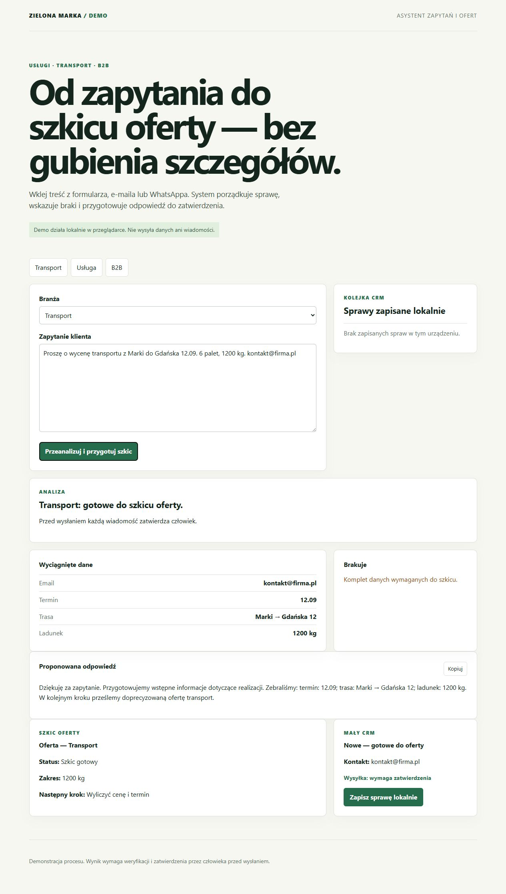

# Lead & Offer Copilot

[](https://github.com/lukaszst-cz/lead-offer-copilot/actions/workflows/test.yml)

**Problem:** klient wysyła zapytanie przez formularz, e-mail lub komunikator. Zespół musi szybko zrozumieć temat, wychwycić braki i przygotować dobrą odpowiedź, bez wysłania czegoś automatycznie i bez kontroli.

**Rozwiązanie:** demonstracja procesu obsługi zapytania: wiadomość → najważniejsze dane → braki → szkic odpowiedzi i oferty → mały CRM → zatwierdzenie człowieka.

[Otwórz działające demo](https://lead-offer-zm.pages.dev/)



## Co pokazuje

- rozpoznanie podstawowych danych z wklejonej wiadomości;
- wymagania dopasowane do transportu, usług, warsztatu, beauty i B2B;
- szkic odpowiedzi, oferty i następnego kroku;
- lokalną kolejkę spraw w małym CRM;
- zasadę: człowiek zatwierdza treść przed wysłaniem.

## Wartość biznesowa

- szybsza odpowiedź na zapytanie;
- mniej pominiętych informacji i zgubionych leadów;
- jednakowy standard obsługi niezależnie od kanału;
- gotowa ścieżka do późniejszego podłączenia AI, e-maila i komunikatora.

## Ważne ograniczenie

To bezpieczne demo działające lokalnie w przeglądarce. Nie wysyła wiadomości i nie przekazuje danych do zewnętrznego modelu. Wersja produkcyjna wymaga ustalenia integracji, retencji danych i uprawnień.

## Testy

```bash
npm test
```


## Technicznie

- statyczna aplikacja JavaScript bez backendu;
- dane kolejki demo są przechowywane lokalnie w przeglądarce;
- demo nie wykonuje połączeń z zewnętrznym modelem AI;
- logika analizy zapytania jest wydzielona w `lib/offer-engine.mjs` i objęta testami Node.js.
